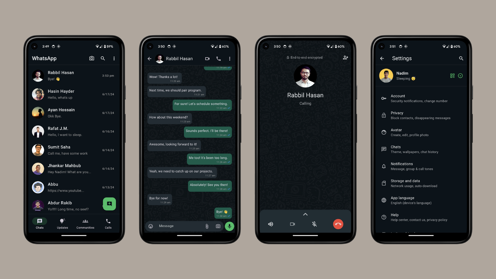
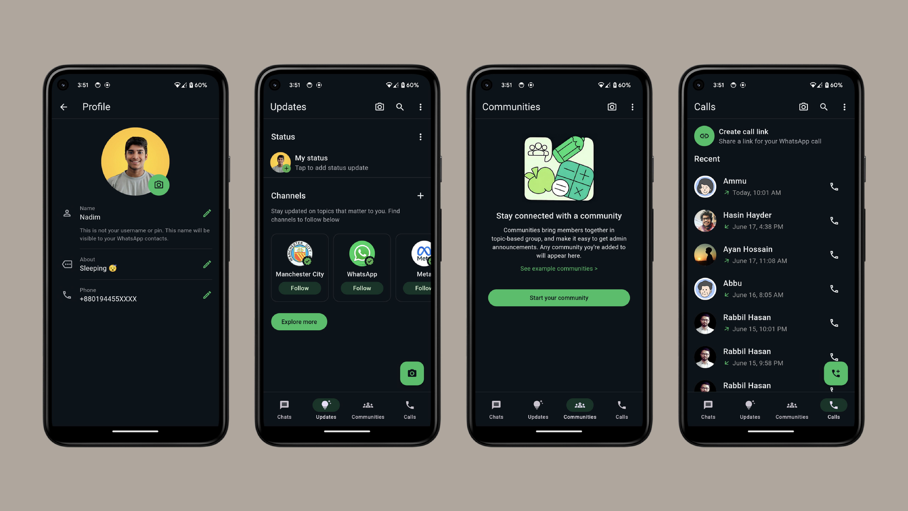

# WhatsApp UI Clone

This repository contains a Flutter project that replicates the user interface of WhatsApp. The project includes multiple screens to mimic the WhatsApp experience, such as the contacts list, chats list, contact profile, user profile, status updates, community, call history, and audio calls.

## Screenshots

Here are some screenshots of the application:




## Features

- **Contacts List:** Browse and manage your contacts.
- **Chats List:** View and engage in conversations.
- **Contact Profile:** View and manage individual contact details.
- **User Profile:** Customize your own profile information.
- **Status Updates:** View and post status updates.
- **Community:** Interact with groups and communities.
- **Call History:** View and manage your call logs.
- **Audio Calls:** Manage and view audio call records.

## Getting Started

To get a local copy up and running follow these simple steps.

### Prerequisites

- Flutter SDK: [Install Flutter](https://flutter.dev/docs/get-started/install)
- Android Studio or VS Code: [Install Android Studio](https://developer.android.com/studio) or [Install VS Code](https://code.visualstudio.com/)

### Installation

1. **Clone the repository:**
    ```bash
   git clone https://github.com/DevNadimm/WhatsApp-UI-Clone.git

2. **Navigate to the project directory:**
    ```bash
   cd WhatsApp-UI-Clone

3. **Install dependencies:**
    ```bash
    flutter pub get
    ```
4. **Run the app:**
    ```bash
    flutter run
    ```

## Requirements

- **Flutter SDK**: Make sure you have Flutter installed on your machine. You can download it from [here](https://flutter.dev/docs/get-started/install).
- **Dart SDK**: Dart is included in the Flutter SDK, so you don’t need to install it separately.

## Project Structure

The project structure follows the standard Flutter project setup:

## Contributing

If you would like to contribute to this project, please fork the repository and submit a pull request. For major changes, please open an issue first to discuss what you would like to change.

1. Fork the Project
2. Create your Feature Branch (`git checkout -b feature/AmazingFeature`)
3. Commit your Changes (`git commit -m 'Add some AmazingFeature'`)
4. Push to the Branch (`git push origin feature/AmazingFeature`)
5. Open a Pull Request

## Contact

If you have any questions, feel free to reach out:

- **Email**: nadimchowdhury87@gmail.com
- **GitHub**: [DevNadim](https://github.com/DevNadim)

---

*This project is not affiliated with WhatsApp or Facebook, Inc. It is an independent project created for educational purposes.*